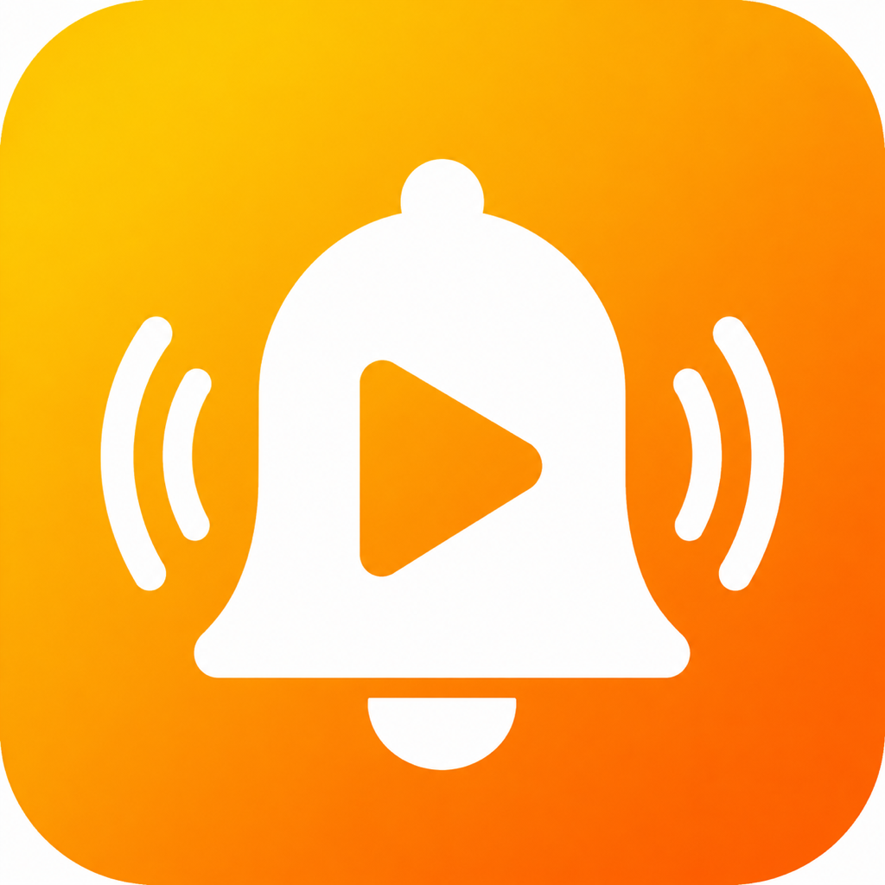

# Fitness Reminder

運動を習慣化するための iOS アプリです。
毎日のリマインダー通知、お気に入り動画へのワンタップアクセス、運動ログの記録をひとつにまとめました。

## 機能

### お気に入り動画一覧
- YouTube・Instagram の動画 URL を登録して一覧管理（最大 10 件）
- タイトルとサムネイルを自動取得
- タップすると YouTube / Instagram アプリで動画を直接開く
- ドラッグ＆ドロップで並び替え、スワイプで削除

### 運動ログ
- 動画を開いてアプリに戻ると「運動できましたか？」のポップアップを表示
- 「やった」でその日の日付をカレンダーに記録
- カレンダー形式で過去3ヶ月の運動履歴を確認できる

### リマインダー通知
- 毎日指定した時間にローカル通知を送信
- 通知時刻はアプリ内の設定画面から変更可能

## 動作環境

- iOS 17.0 以上

## 技術スタック

| 分類 | 技術 |
|------|------|
| 言語 | Swift 6 |
| UI | SwiftUI |
| アーキテクチャ | MVVM |
| 永続化 | UserDefaults |
| 通知 | UserNotifications |
| 外部ライブラリ | なし |
