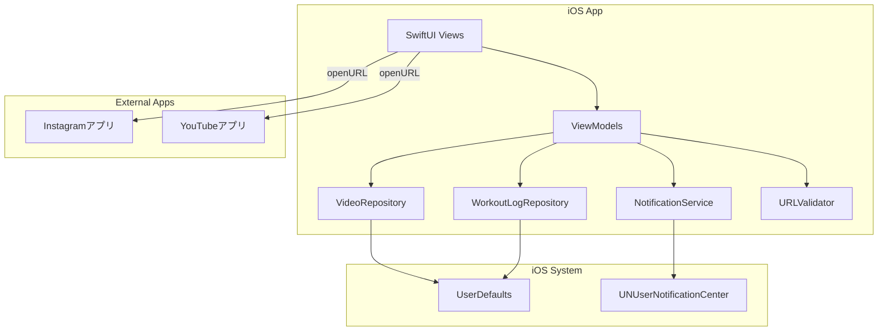

# 技術仕様書

## テクノロジースタック

| 分類 | 技術 | 選定理由 |
|------|------|---------|
| 言語 | Swift 6 | iOS開発の標準言語 |
| UI フレームワーク | SwiftUI | 宣言的UIで開発速度が高い、MVVM親和性が高い |
| 最小ターゲット | iOS 17.0 | SwiftUI の最新機能（`@Observable` 等）が利用可能 |
| 永続化 | UserDefaults | 少量のシンプルなデータに最適、セットアップ不要 |
| 通知 | UserNotifications | iOS標準ローカル通知フレームワーク |
| 外部ライブラリ | なし | シンプルな要件のため依存ゼロを維持 |
| パッケージマネージャー | Swift Package Manager | Xcode標準、追加ツール不要 |

## システム構成



## ディレクトリ構成（予定）

```
FitnessReminder/
├── FitnessReminderApp.swift       # アプリエントリーポイント
├── Models/
│   ├── VideoItem.swift            # 動画データモデル
│   ├── AppSettings.swift         # 設定データモデル
│   └── WorkoutLog.swift          # 運動ログデータモデル
├── ViewModels/
│   ├── VideoListViewModel.swift   # 動画リストのロジック
│   ├── SettingsViewModel.swift    # 設定のロジック
│   └── WorkoutLogViewModel.swift  # ログ・カレンダーのロジック
├── Views/
│   ├── VideoListView.swift        # 動画リスト画面
│   ├── AddVideoView.swift         # 動画追加画面
│   ├── SettingsView.swift         # 設定画面
│   ├── WorkoutLogView.swift       # ログ・カレンダー画面
│   └── WorkoutCompletionPopup.swift # 運動完了確認ポップアップ
├── Services/
│   ├── VideoRepository.swift      # UserDefaults永続化（動画）
│   ├── WorkoutLogRepository.swift # UserDefaults永続化（ログ）
│   └── NotificationService.swift  # ローカル通知管理
└── Utilities/
    └── URLValidator.swift         # URLバリデーション
```

## 開発ツール

| ツール | バージョン | 用途 |
|--------|-----------|------|
| Xcode | 16以上 | IDE・ビルド・シミュレーター |
| iOS Simulator | iOS 17以上 | 動作確認 |
| Git | - | バージョン管理 |

## 技術的制約と要件

### 通知
- アプリがフォアグラウンド中は通知バナーを表示しない（iOS標準動作）
- 通知権限はユーザーの明示的な許可が必要
- `UNCalendarNotificationTrigger` で毎日繰り返し設定（1つの通知を使い回す）

### 外部アプリ連携
- `UIApplication.shared.open(_:)` または SwiftUI の `openURL` で外部アプリを起動
- Instagramアプリ未インストール時はSafariで開く（iOS標準フォールバック）
- YouTubeアプリ未インストール時はSafariで開く（iOS標準フォールバック）

### データ永続化
- `UserDefaults` は最大数MB程度のデータ保存に適しており、動画URLの保存には十分
- `Codable` プロトコルを使用してJSON形式でエンコード/デコード

## パフォーマンス要件

- アプリ起動から動画リスト表示まで：1秒以内
- 動画追加・削除・並び替えの反映：即時（同期処理）
- ネットワーク通信：なし（完全オフライン動作）
