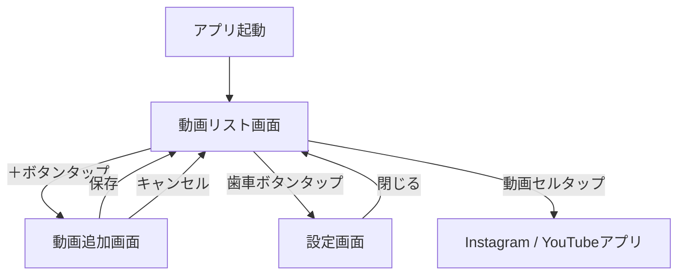
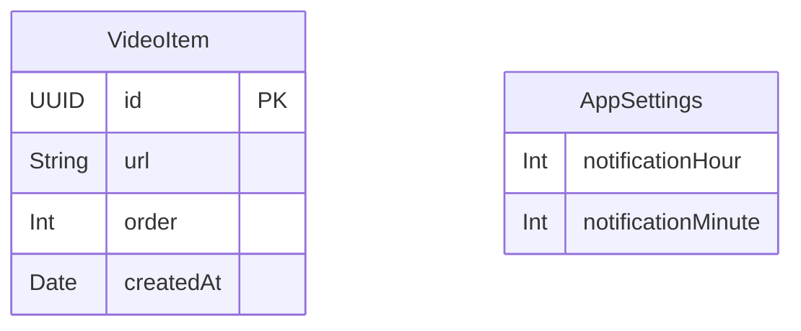

# 機能設計書

## 画面構成

アプリは3つの画面で構成されます。

```
┌─────────────────────┐
│   動画リスト画面      │  ← 起動直後に表示（ホーム画面）
│  （VideoListView）   │
└──────┬──────┬───────┘
       │      │
       ▼      ▼
┌──────────┐  ┌──────────────┐
│ 動画追加  │  │  設定画面    │
│  画面    │  │（SettingsView）│
│(AddVideo │  └──────────────┘
│  View)   │
└──────────┘
```

## 画面遷移図



## 画面ワイヤフレーム

### 動画リスト画面（VideoListView）

```
┌────────────────────────┐
│ ≡  運動リマインダー  ⚙️  │  ← ナビゲーションバー
├────────────────────────┤
│ ┌──────────────────┐   │
│ │ 🎬 https://www.i │   │  ← 動画セル（URLのドメイン表示）
│ │    nstagram.com/ │   │
│ └──────────────────┘   │
│ ┌──────────────────┐   │
│ │ 🎬 https://www.y │   │
│ │    outu.be/...   │   │
│ └──────────────────┘   │
│                        │
│                        │
│         ＋             │  ← 追加ボタン（右下 FAB）
└────────────────────────┘
```

- セルをタップ → 対応アプリ（Instagram / YouTube）を開く
- セルを左スワイプ → 削除ボタン表示
- セルを長押しドラッグ → 並び替え
- ⚙️ タップ → 設定画面へ

### 動画追加画面（AddVideoView）

```
┌────────────────────────┐
│ ✕  動画を追加      保存 │  ← ナビゲーションバー
├────────────────────────┤
│                        │
│  動画URL               │
│ ┌──────────────────┐   │
│ │ URLを貼り付け     │   │  ← テキストフィールド
│ └──────────────────┘   │
│                        │
│  ※ Instagram または    │
│     YouTube の URL     │
│                        │
└────────────────────────┘
```

- URLの形式バリデーション（Instagram / YouTube ドメイン）
- 不正なURLの場合はエラーメッセージ表示、保存ボタン無効化
- 「保存」タップ → リストに追加してリスト画面へ戻る

### 設定画面（SettingsView）

```
┌────────────────────────┐
│ ✕  設定                │
├────────────────────────┤
│                        │
│  リマインダー時刻       │
│ ┌──────────────────┐   │
│ │    07 : 00       │   │  ← 時刻ピッカー
│ └──────────────────┘   │
│                        │
│  [通知を許可する]       │  ← 未許可時のみ表示
│                        │
└────────────────────────┘
```

- 時刻ピッカーで通知時刻を設定
- 設定変更 → 即座にローカル通知を再スケジュール
- 通知権限が未取得の場合は許可ボタンを表示

## データモデル



### VideoItem

| フィールド | 型 | 説明 |
|-----------|-----|------|
| id | UUID | 一意識別子 |
| url | String | Instagram / YouTube の動画URL |
| order | Int | 表示順（0始まり） |
| createdAt | Date | 登録日時 |

### AppSettings

| フィールド | 型 | 説明 |
|-----------|-----|------|
| notificationHour | Int | 通知時刻（時） |
| notificationMinute | Int | 通知時刻（分） |

## コンポーネント設計

### アーキテクチャ：MVVM

```
View（SwiftUI）
  └── ViewModel（ObservableObject）
        ├── VideoRepository（永続化）
        └── NotificationService（通知管理）
```

### 主要コンポーネント

| コンポーネント | 責務 |
|---------------|------|
| `VideoListView` | 動画リストの表示・操作UI |
| `AddVideoView` | URL入力・バリデーション・追加UI |
| `SettingsView` | 通知時刻の設定UI |
| `VideoListViewModel` | リスト操作のビジネスロジック |
| `SettingsViewModel` | 設定操作のビジネスロジック |
| `VideoRepository` | UserDefaultsへの永続化 |
| `NotificationService` | UNUserNotificationCenterの管理 |
| `URLValidator` | Instagram / YouTube URLのバリデーション |

## URLバリデーション仕様

対応ドメイン：
- `instagram.com`
- `www.instagram.com`
- `youtu.be`
- `youtube.com`
- `www.youtube.com`
- `m.youtube.com`

## 通知仕様

- 種別：ローカル通知（UNUserNotification）
- トリガー：毎日指定時刻（UNCalendarNotificationTrigger、repeats: true）
- 通知タイトル：「運動の時間です 💪」
- 通知本文：「今日も動画を見ながら運動しよう！」
- 通知タップ時：アプリが起動し動画リスト画面を表示

## 永続化仕様

- `VideoItem` の配列を `UserDefaults` に JSON エンコードして保存
- `AppSettings` も `UserDefaults` に保存
- キー名：`videoItems`、`notificationHour`、`notificationMinute`
